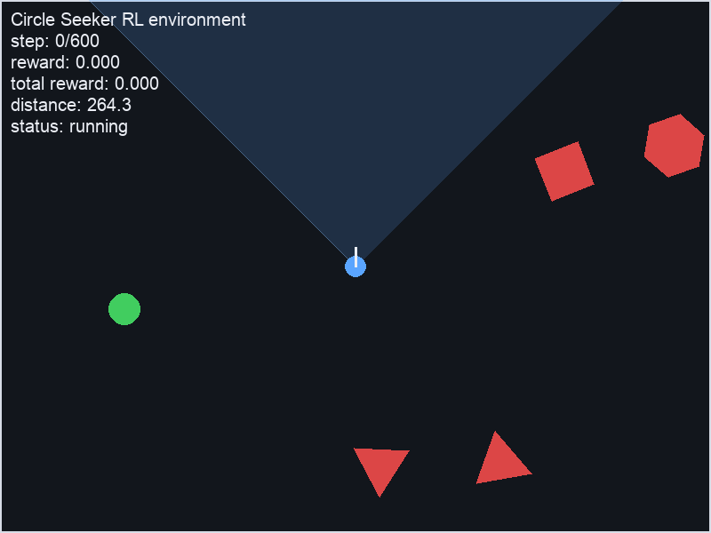
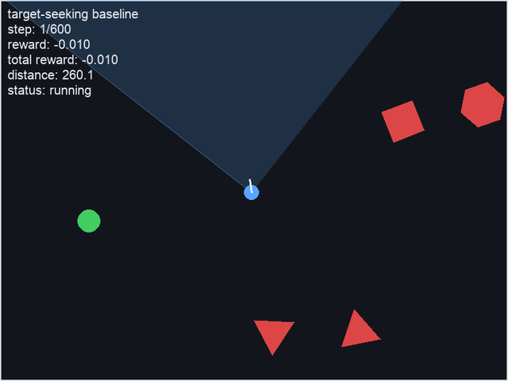
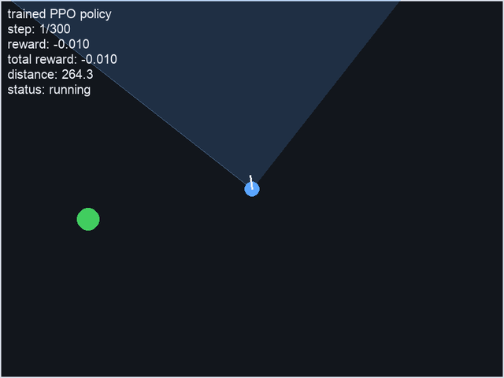
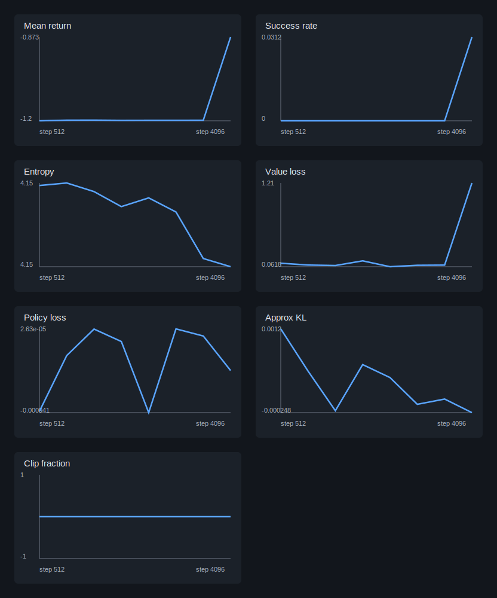

# Circle Seeker RL

[](https://github.com/AlexandreEDMOND/Circle-Seeker-RL/actions/workflows/ci.yml)

Circle Seeker RL is a small Python reinforcement learning project focused on
implementing Proximal Policy Optimization (PPO) from the paper on a custom 2D
environment.

An agent moves in a top-down 2D world and must reach a green circular target while avoiding moving red polygon obstacles. The agent has its own oriented cone of vision: it can see to the environment bounds, but polygon obstacles block line of sight. The project includes clean environment mechanics, visual debugging, baseline policies, and early from-scratch PPO components.

## Project Goals

- Build a simple, readable RL environment from scratch.
- Keep the API close to Gymnasium: `reset()`, `step()`, observations, rewards, `terminated`, `truncated`, and `info`.
- Provide a pygame renderer to inspect the simulation.
- Support manual keyboard control and a random policy baseline.
- Implement PPO from the original paper before comparing against library baselines.
- Keep the codebase small enough that the PPO objective, advantage estimation,
  rollout collection, and evaluation loop remain easy to inspect.

## Preview

The pygame window displays:

- blue circle: agent
- green circle: target
- red polygons: moving obstacles
- translucent blue cone: agent field of vision
- HUD: current step, reward, cumulative reward, distance to target, episode status



Target-seeking baseline movement:



Trained PPO policy playback:



Random policy vs trained PPO trajectory on the same seeded environment:


## Installation

Prerequisites:

- Python 3.11+
- uv
- ffmpeg, only if you want to regenerate the README GIFs

Create the local virtual environment and install dependencies:

```bash
uv sync
```

This creates a local `.venv` and installs the dependencies from `pyproject.toml` / `uv.lock`.

If you prefer pip, the same runtime dependencies are also listed in `requirements.txt`.

## Run

Manual control:

```bash
uv run python src/manual_play.py
```

Controls:

- Arrow keys: move the agent, including diagonal movement when multiple keys are held
- `A` / `D`: rotate the agent's vision direction
- `R`: reset the environment
- `ESC`: quit

Random policy:

```bash
uv run python src/random_play.py
```

Baseline evaluation:

```bash
uv run python -m src.evaluate_baselines --episodes 100 --seed 123
```

Visual baseline playback:

```bash
uv run python -m src.watch_baseline --policy heuristic --seed 123
uv run python -m src.watch_baseline --policy random --seed 123
```

Save baseline metrics to disk:

```bash
uv run python -m src.evaluate_baselines --episodes 100 --seed 123 --output results/baselines.json
```

Train a PPO checkpoint:

```bash
uv run python -m src.train_ppo --total-timesteps 100000 --checkpoint checkpoints/ppo.pt
```

Optionally stop unstable PPO updates early when approximate KL gets too high:

```bash
uv run python -m src.train_ppo --total-timesteps 100000 --target-kl 0.03 --checkpoint checkpoints/ppo.pt
```

Evaluate a PPO checkpoint:

```bash
uv run python -m src.evaluate_ppo checkpoints/ppo.pt --episodes 50 --seed 123
```

Plot PPO training curves from a checkpoint:

```bash
uv run python scripts/plot_training_metrics.py checkpoints/ppo.pt --output results/training_curves.svg
```

Example PPO training curves from a short local run:



Visual PPO playback:

```bash
uv run python -m src.watch_ppo checkpoints/ppo.pt --seed 123
```

For an easier first PPO run, train without obstacles and allow closer target spawns:

```bash
uv run python -m src.train_ppo --total-timesteps 50000 --rollout-steps 1024 --update-epochs 4 --minibatch-size 128 --obstacle-count 0 --max-steps 300 --min-target-distance 80 --distance-reward-coef 0.2 --target-visible-reward-coef 0.02 --target-found-reward-coef 0.2 --no-vision-no-turn-penalty 0.005 --action-conflict-penalty 0.02 --checkpoint checkpoints/ppo_simple.pt
uv run python -m src.evaluate_ppo checkpoints/ppo_simple.pt --episodes 20 --seed 456
uv run python -m src.watch_ppo checkpoints/ppo_simple.pt --seed 123
```

On the local `ppo_simple.pt` run produced by the command above, deterministic
evaluation with `--episodes 20 --seed 456` produced:

- success rate: `0.15`
- collision rate: `0.0`
- timeout rate: `0.85`
- mean return: `-1.245`
- mean initial distance: `289.224`
- mean final distance: `232.628`

## Benchmark Snapshot

Obstacle-heavy benchmark, evaluated with seed `900`:

| Policy | Success | Collision | Timeout | Mean return |
| --- | ---: | ---: | ---: | ---: |
| Random | 0.000 | 0.500 | 0.500 | -7.071 |
| Target-seeking heuristic | 0.767 | 0.233 | 0.000 | 4.847 |
| PPO simple checkpoint, no-obstacle eval | 0.200 | 0.000 | 0.800 | -0.582 |
| PPO obstacles, direct 20k tuning, mean over seeds 101/202/303 | 0.011 | 0.344 | 0.644 | -5.565 |
| PPO V1 short, structured actions + curriculum + obstacle proximity penalty | 0.800 | 0.200 | 0.000 | 5.143 |

The V1 short checkpoint was evaluated over 50 deterministic episodes with:

```bash
uv run python -m src.evaluate_ppo checkpoints/v1/ppo_v1_short_best.pt --episodes 50 --seed 900
```

Its local evaluation also reported `near_obstacle_rate = 0.250`,
`mean_nearest_obstacle_clearance = 112.009`, and `turn_action_rate = 0.995`.
The checkpoint itself is ignored by git under `checkpoints/`; reproduce it with:

```bash
uv run python -m src.train_ppo \
  --total-timesteps 300000 \
  --rollout-steps 2048 \
  --update-epochs 4 \
  --minibatch-size 256 \
  --hidden-size 128 \
  --learning-rate 0.00025 \
  --seed 202 \
  --obstacle-count 4 \
  --max-steps 300 \
  --min-target-distance 120 \
  --distance-reward-coef 0.2 \
  --target-visible-reward-coef 0.02 \
  --target-found-reward-coef 0.2 \
  --no-vision-no-turn-penalty 0.005 \
  --obstacle-proximity-penalty-coef 0.05 \
  --obstacle-proximity-threshold 60 \
  --target-kl 0.03 \
  --curriculum \
  --curriculum-stages 5 \
  --curriculum-start-obstacle-speed 0.0 \
  --curriculum-start-obstacle-radius 0.0 \
  --eval-every 50000 \
  --eval-episodes 10 \
  --eval-seed 900 \
  --checkpoint checkpoints/v1/ppo_v1_short_last.pt \
  --best-checkpoint checkpoints/v1/ppo_v1_short_best.pt \
  --no-progress
```

See `docs/benchmarks/ppo_obstacle_benchmark.md` for older short-run benchmark
notes from before the V1 obstacle-proximity shaping pass.

## Test

Run the full test suite:

```bash
uv run pytest
```

Run a quick source compilation check:

```bash
uv run python -m compileall src
```

Run a small environment smoke test:

```bash
uv run python -c 'from src.env import CircleSeekEnv; env = CircleSeekEnv(); obs = env.reset(seed=123); print(obs.shape); print(env.step(CircleSeekEnv.ACTION_NOOP)[1:])'
```

## Environment API

Main class: `CircleSeekEnv` in `src/env.py`.
Gymnasium adapter: `CircleSeekGymEnv` in `src/gym_env.py`.

```python
from src.env import CircleSeekEnv
from src.gym_env import CircleSeekGymEnv

env = CircleSeekEnv()
observation = env.reset(seed=123)
observation, reward, terminated, truncated, info = env.step(CircleSeekEnv.ACTION_NOOP)

gym_env = CircleSeekGymEnv(render_mode="human")
observation, info = gym_env.reset(seed=123)
observation, reward, terminated, truncated, info = gym_env.step(CircleSeekEnv.ACTION_NOOP)
gym_env.render()
gym_env.close()
```

Actions:

The environment uses a 6-bit `MultiBinary` action vector so movement and orientation can happen at the same time.
PPO now uses a structured action policy internally: one categorical choice for
movement (`noop`, cardinal directions, and diagonals) and one categorical choice
for turning (`none`, left, right), then converts those two indices back to the
6-bit environment action. This keeps the environment API unchanged while
preventing contradictory PPO actions such as up+down, left+right, or turn
left+turn right.

| Index | Meaning |
| --- | --- |
| `0` | move up |
| `1` | move down |
| `2` | move left |
| `3` | move right |
| `4` | turn vision left |
| `5` | turn vision right |

Episode endings:

- `success`: the agent reaches the target
- `collision`: the agent touches an obstacle
- `timeout`: the maximum number of steps is reached

Rewards:

- `+10` for reaching the target
- `-10` for colliding with an obstacle
- `-0.01` step penalty
- optional small shaping bonus when moving closer to the target

Observation vector:

- normalized ray distances across the agent's vision cone
- target visibility flag
- target angle relative to the agent's orientation, only when visible
- normalized distance to target, only when visible
- agent orientation as `cos(theta), sin(theta)`

The Gymnasium wrapper exposes finite observation bounds for these values and supports
`render_mode="human"` and `render_mode="rgb_array"`.

## Repository Structure

```text
.
├── .github/workflows/ci.yml
├── docs/
│   ├── benchmarks/
│   │   └── ppo_obstacle_benchmark.md
│   └── media/
│       ├── agent_scan_movement.gif
│       ├── environment_vision.png
│       ├── ppo_scan_trained.gif
│       ├── training_curves.svg
│       └── trajectory_scan_comparison.png
├── scripts/
│   ├── generate_readme_media.py
│   └── plot_training_metrics.py
├── src/
│   ├── __init__.py
│   ├── env.py
│   ├── evaluate_ppo.py
│   ├── gym_env.py
│   ├── renderer.py
│   ├── ppo.py
│   ├── train_ppo.py
│   ├── watch_ppo.py
│   ├── manual_play.py
│   └── random_play.py
├── tests/
│   ├── test_env.py
│   ├── test_evaluate_baselines.py
│   ├── test_gym_env.py
│   ├── test_plot_training_metrics.py
│   ├── test_ppo.py
│   └── test_renderer.py
├── paper/
│   └── Proximal Policy Optimization Algorithms.pdf
├── ROADMAP.md
├── TODO.md
├── LICENSE
├── pyproject.toml
├── requirements.txt
├── uv.lock
└── README.md
```

## Current Scope

Implemented:

- 2D environment mechanics
- moving polygon obstacles with wall and obstacle-to-obstacle bounce
- oriented cone-of-vision raycasting with obstacle occlusion
- minimum spawn distance between agent and target
- reward function and episode termination
- partial numeric observations for future RL training
- Gymnasium adapter with explicit observation and action spaces
- random and target-seeking heuristic baseline evaluation
- from-scratch PPO actor-critic implementation with rollout buffer, GAE returns,
  environment rollout collection, clipped policy objective, value loss, entropy
  bonus, mini-batch updates, checkpoint saving, checkpoint evaluation, and
  per-update training metrics
- pygame visualization
- manual and random-play scripts
- SVG training curve generation from checkpoint metrics
- PyTorch actor-critic model
- PPO rollout buffer with GAE returns and advantages
- unit tests and GitHub Actions CI
- local PPO paper copy under `paper/`

Not included yet:

- vectorized environments
- advanced experiment tracking
- tuned hyperparameters for the obstacle-heavy task

## PPO Paper Mapping

The first implementation target is the PPO clipped objective from the paper.
The code maps to the paper components as follows:

- policy and value function: `ActorCritic` in `src/ppo.py`
- old action log probabilities: `RolloutBuffer.log_probs`
- probability ratio: `ratio = exp(new_log_prob - old_log_prob)` in `compute_ppo_loss`
- clipped surrogate objective: `torch.min(ratio * advantages, clipped_ratio * advantages)`
- value-function loss: squared error between computed returns and value estimates
- entropy bonus: categorical movement entropy plus categorical turn entropy
- advantage estimates: truncated GAE in `RolloutBuffer.compute_returns_and_advantages`
- multiple epochs with shuffled mini-batches: the update loop in `train_ppo`
- optional KL early stopping: `--target-kl` stops the current PPO update when
  approximate KL exceeds the configured threshold
- diagnostics: per-update policy loss, value loss, entropy, approximate KL, clip fraction,
  return, success rate, collision rate, and timeout rate saved in checkpoints

## Paper Reference

The copied paper file is under `paper/`.
The PPO implementation target is:

- `paper/Proximal Policy Optimization Algorithms.pdf`

## Roadmap

The implementation roadmap now targets a from-scratch PPO implementation for this environment.

See `ROADMAP.md` for the staged plan and `TODO.md` for the current task list.

## License

This project is licensed under the MIT License. See `LICENSE` for details.
