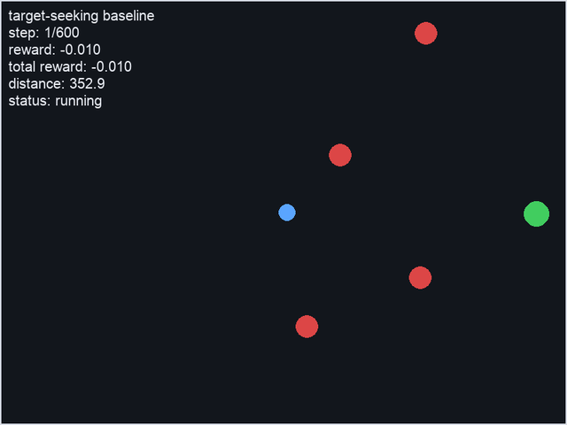
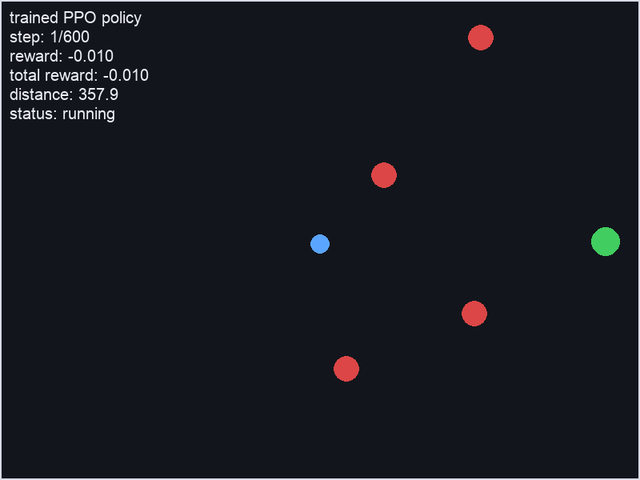
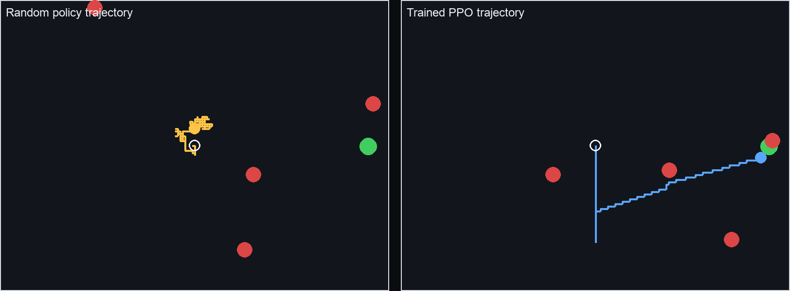

# Circle Seeker RL

[](https://github.com/AlexandreEDMOND/Circle-Seeker-RL/actions/workflows/ci.yml)

Circle Seeker RL is a small Python reinforcement learning project focused on
implementing Proximal Policy Optimization (PPO) from the paper on a custom 2D
environment.

An agent moves in a top-down 2D world and must reach a green circular target while avoiding moving red circular obstacles. The project includes clean environment mechanics, visual debugging, baseline policies, and a compact from-scratch PPO training pipeline.

## Project Goals

- Build a simple, readable RL environment from scratch.
- Keep the API close to Gymnasium: `reset()`, `step()`, observations, rewards, `terminated`, `truncated`, and `info`.
- Provide a pygame renderer to inspect the simulation.
- Support manual keyboard control and a random policy baseline.
- Implement PPO from the original paper before comparing against library baselines.
- Keep the codebase small enough that the PPO objective, advantage estimation,
  rollout collection, and evaluation loop remain easy to inspect.

## Preview

The pygame window displays:

- blue circle: agent
- green circle: target
- red circles: moving obstacles
- HUD: current step, reward, cumulative reward, distance to target, episode status


Target-seeking baseline movement:



Trained PPO policy playback:



Random policy vs trained PPO trajectory on the same seeded environment:



## Installation

Prerequisites:

- Python 3.11+
- uv
- ffmpeg, only if you want to regenerate the README GIFs

Create the local virtual environment and install dependencies:

```bash
uv sync
```

This creates a local `.venv` and installs the dependencies from `pyproject.toml` / `uv.lock`.

If you prefer pip, the same runtime dependencies are also listed in `requirements.txt`.

## Run

Manual control:

```bash
uv run python src/manual_play.py
```

Controls:

- Arrow keys: move the agent
- `R`: reset the environment
- `ESC`: quit

Random policy:

```bash
uv run python src/random_play.py
```

Baseline evaluation:

```bash
uv run python -m src.evaluate_baselines --episodes 100 --seed 123
```

Visual baseline playback:

```bash
uv run python -m src.watch_baseline --policy heuristic --seed 123
uv run python -m src.watch_baseline --policy random --seed 123
```

Save baseline metrics to disk:

```bash
uv run python -m src.evaluate_baselines --episodes 100 --seed 123 --output results/baselines.json
```

Train a PPO checkpoint:

```bash
uv run python -m src.train_ppo --total-timesteps 100000 --checkpoint checkpoints/ppo.pt
```

Evaluate a PPO checkpoint:

```bash
uv run python -m src.evaluate_ppo checkpoints/ppo.pt --episodes 50 --seed 123
```

Visual PPO playback:

```bash
uv run python -m src.watch_ppo checkpoints/ppo.pt --seed 123
```

For quick debugging, start with an easier no-obstacle run:

```bash
uv run python -m src.train_ppo --total-timesteps 50000 --obstacle-count 0 --max-steps 300 --checkpoint checkpoints/ppo_simple.pt
uv run python -m src.evaluate_ppo checkpoints/ppo_simple.pt --episodes 50
```

Train with curriculum learning:

```bash
uv run python -m src.train_ppo --curriculum --curriculum-stages 4 --total-timesteps 100000 --obstacle-count 4 --checkpoint checkpoints/ppo_curriculum.pt
uv run python -m src.evaluate_ppo checkpoints/ppo_curriculum.pt --episodes 50
```

The curriculum keeps the number of obstacle observation slots fixed and gradually
increases obstacle radius and speed. This avoids changing the neural network
input size during training.

Regenerate README media from a trained checkpoint:

```bash
uv run python scripts/generate_readme_media.py --checkpoint checkpoints/ppo_curriculum.pt --output-dir docs/media --seed 134 --gif-frames 200
```

## Test

Run the full test suite:

```bash
uv run pytest
```

Run a quick source compilation check:

```bash
uv run python -m compileall src
```

Run a small environment smoke test:

```bash
uv run python -c 'from src.env import CircleSeekEnv; env = CircleSeekEnv(); obs = env.reset(seed=123); print(obs.shape); print(env.step(0)[1:])'
```

## Environment API

Main class: `CircleSeekEnv` in `src/env.py`.
Gymnasium adapter: `CircleSeekGymEnv` in `src/gym_env.py`.

```python
from src.env import CircleSeekEnv
from src.gym_env import CircleSeekGymEnv

env = CircleSeekEnv()
observation = env.reset(seed=123)
observation, reward, terminated, truncated, info = env.step(0)

gym_env = CircleSeekGymEnv()
observation, info = gym_env.reset(seed=123)
observation, reward, terminated, truncated, info = gym_env.step(0)
```

Actions:

| Action | Meaning |
| --- | --- |
| `0` | no-op |
| `1` | up |
| `2` | down |
| `3` | left |
| `4` | right |

Episode endings:

- `success`: the agent reaches the target
- `collision`: the agent touches an obstacle
- `timeout`: the maximum number of steps is reached

Rewards:

- `+10` for reaching the target
- `-10` for colliding with an obstacle
- `-0.01` step penalty
- optional small shaping bonus when moving closer to the target

Observation vector:

- normalized agent position
- target position relative to the agent
- for each obstacle: relative position and velocity
- normalized distance to target

## Repository Structure

```text
.
├── .github/workflows/ci.yml
├── docs/
│   └── media/
│       ├── agent_movement.gif
│       ├── environment.png
│       ├── ppo_trained.gif
│       └── trajectory_comparison.png
├── scripts/
│   └── generate_readme_media.py
├── src/
│   ├── __init__.py
│   ├── env.py
│   ├── evaluate_ppo.py
│   ├── gym_env.py
│   ├── renderer.py
│   ├── ppo.py
│   ├── train_ppo.py
│   ├── watch_ppo.py
│   ├── manual_play.py
│   └── random_play.py
├── tests/
│   └── test_env.py
├── paper/
│   └── Proximal Policy Optimization Algorithms.pdf
├── ROADMAP.md
├── TODO.md
├── LICENSE
├── pyproject.toml
├── requirements.txt
├── uv.lock
└── README.md
```

## Current Scope

Implemented:

- 2D environment mechanics
- moving circular obstacles with wall bounce
- reward function and episode termination
- numeric observations for future RL training
- Gymnasium adapter with explicit observation and action spaces
- random and target-seeking heuristic baseline evaluation
- from-scratch PPO actor-critic implementation with rollout buffer, GAE,
  clipped policy objective, value loss, entropy bonus, and checkpoint saving
- PPO training, curriculum training, evaluation, and visual playback scripts
- pygame visualization
- manual and random-play scripts
- unit tests and GitHub Actions CI
- local PPO paper copy under `paper/`

Not included yet:

- Gymnasium inheritance
- vectorized environments
- advanced experiment tracking
- tuned hyperparameters for the obstacle-heavy task

## Paper Reference

The copied paper file is under `paper/`.
The PPO implementation target is:

- `paper/Proximal Policy Optimization Algorithms.pdf`

## Roadmap

The implementation roadmap now targets a from-scratch PPO implementation for this environment.

See `ROADMAP.md` for the staged plan and `TODO.md` for the current task list.

## License

This project is licensed under the MIT License. See `LICENSE` for details.
